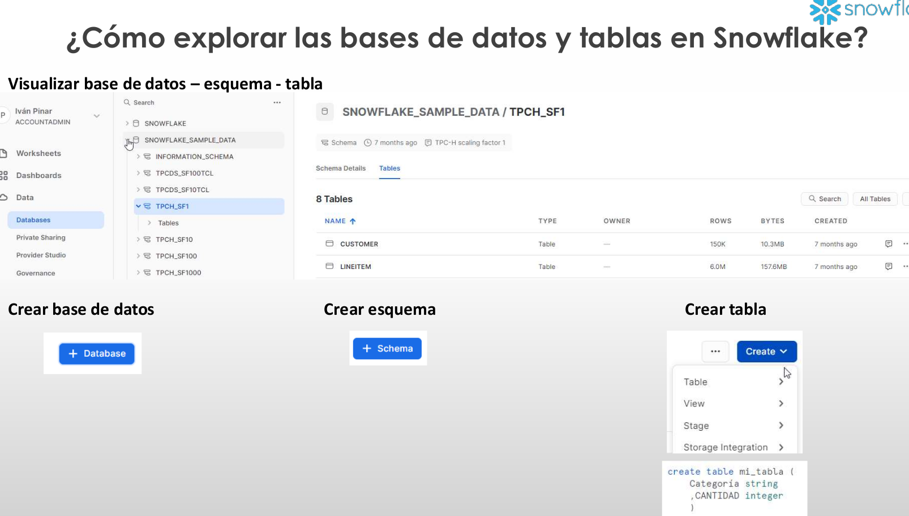

# 1-Introduccion
1. [¿Qué es un data warehouse?](#schema1)
2. [Arquitectura de Snowflake y sus ventajas](#schema2)
3. [Ediciones de Snowflake y precios](#schema3)
4. [Registro en Snowflake y primeros pasos](#schema4)
5. [Crear un nuevo warehouse mediante interfaz o usando SQL](#schema5)
6. [ ¿Cómo explorar las bases de datos y tablas en Snowflake?](#schema6)
7. [Monitorizar el uso](#schema7)


<hr>

<a name="schema1"></a>

## 1. ¿Qué es un data warehouse?


<hr>

<a name="schema2"></a>

## 2. Arquitectura de Snowflake y sus ventajas


<hr>

<a name="schema3"></a>

## 3. Ediciones de Snowflake y precios


<hr>

<a name="schema4"></a>

## 4. Registro en Snowflake y primeros pasos

1. Crear una base de datos de muestra si no está ya creada en Snowflake por defecto
```sql
create database snowflake_sample_data from share sfc_samples.sample_data;
```
2. Dar acceso público a la base de datos para que todo tipo de usuarios y roles puedan acceder a ella
```sql
grant imported privileges on database snowflake_sample_data to role public;
```

<hr>

<a name="schema5"></a>

## 5. Crear un nuevo warehouse mediante interfaz o usando SQL


```sql
CREATE WAREHOUSE EJEMPLO_WAREHOUSE
WITH
WAREHOUSE_SIZE=XSMALL
MAX_CLUSTER_COUNT=3
AUTO_SUSPEND = 300
AUTO_RESUME = TRUE
INITIALLY_SUSPENDED = TRUE
COMMENT ="Ejemplo de warehouse"

DROP WAREHOUSE EJEMPLO_WAREHOUSE
```

<hr>

<a name="schema6"></a>

## 6. ¿Cómo explorar las bases de datos y tablas en Snowflake?



<hr>

<a name="schema7"></a>

## 7. Monitorizar el uso


REF:
https://www.udemy.com/course/master-snowflake-data-warehouse-en-la-nube-2023/